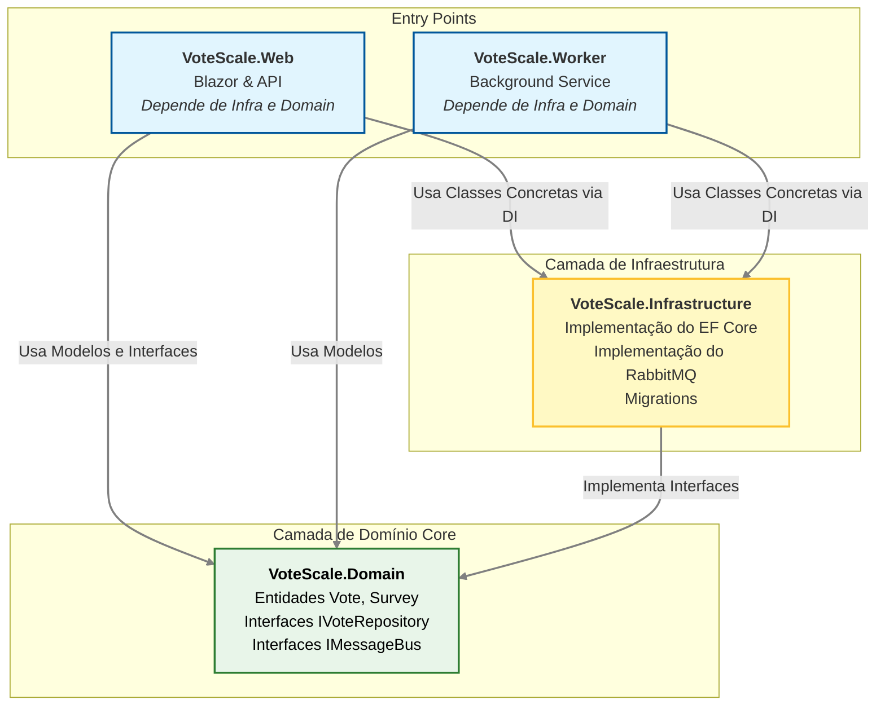
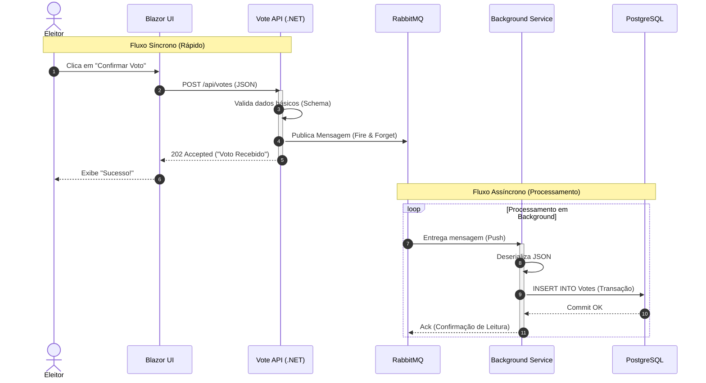
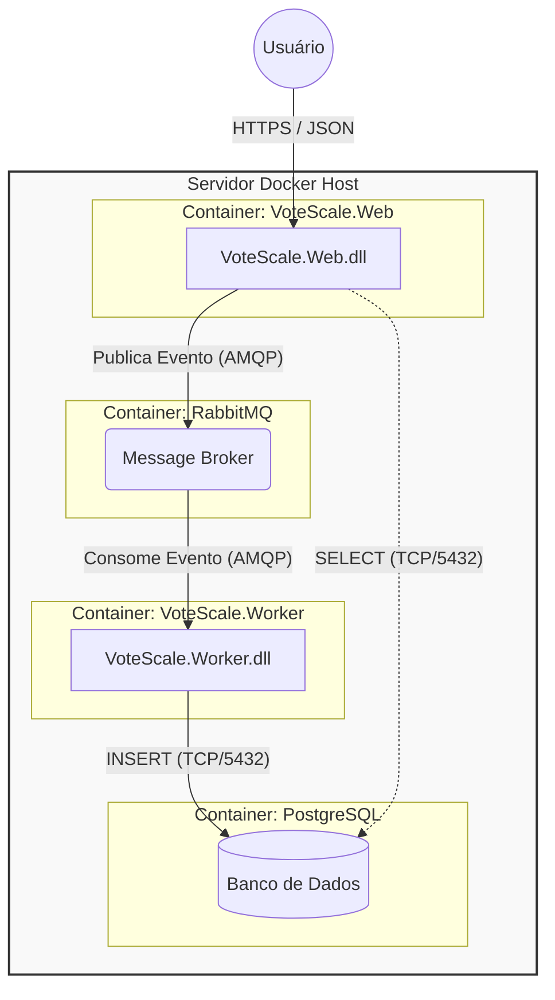
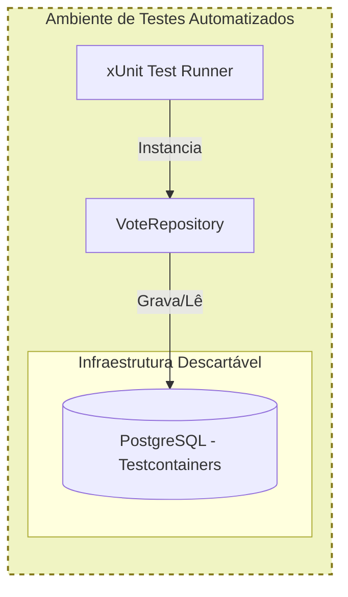

# Diagramas de Arquitetura do Projeto (definições em andamento, não é versão final)  

### Arquitetura em Camadas e Dependências: Este diagrama ilustra a aplicação estrita do princípio de inversão de dependência. A camada Web (Interface) e o Worker (Serviço) dependem apenas das abstrações definidas no Domain e das implementações concretas da Infrastructure. O Domain permanece puro, sem conhecimento de banco de dados ou frameworks externos, facilitando a testabilidade e a manutenção.  

### Fluxo de Votação Assíncrono (Event-Driven): Demonstração do padrão Fire-and-Forget. Para garantir alta disponibilidade sob tráfego massivo, a API não grava no banco diretamente. Ela delega a responsabilidade para o Message Broker (RabbitMQ) e responde imediatamente ao eleitor. O processamento pesado (persixtência SQL) ocorre em segundo plano, desacoplado da experiência do usuário.  

### Topologia de Implantação Containerizada: Visão física da infraestrutura isolada via Docker. Cada responsabilidade (Web, Worker, Banco e Mensageria) reside em seu próprio container, garantindo isolamento de recursos, facilidade de escalabilidade horizontal (podemos subir mais réplicas do Worker se necessário) e paridade entre os ambientes de desenvolvimento e produção.  

### Estratégia de Testes Automatizados (Visualização)  

O diagrama abaixo ilustra como garantimos a qualidade do componente de dados (EF Core) isolando o ambiente via Testcontainers, sem sujar o banco de produção.  

