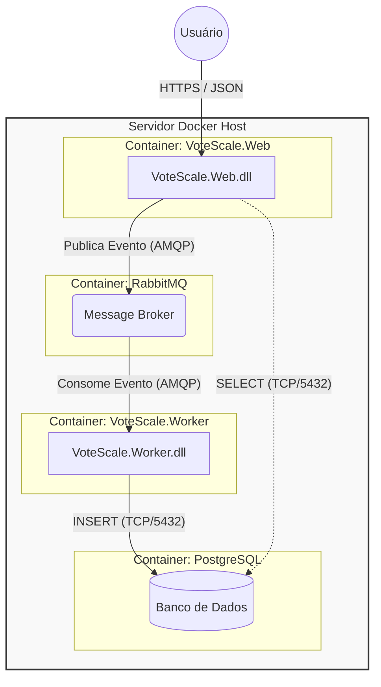

# 🗳️ VoteScale - Sistema de Votação Pública de Alta Performance

> Solução de questionários online resiliente e escalável, arquitetada para suportar votações massivas (eleições) utilizando o ecossistema .NET 9 e Containerização.


## 📋 Visão Geral e Desafio de Negócio

Este projeto foi concebido para atender a uma startup em um cenário crítico: realizar pesquisas públicas sobre eleições. O sistema deve suportar **milhões de acessos simultâneos**, garantindo que nenhum voto seja perdido, mesmo sob picos extremos de carga.

Devido ao prazo curto e à equipe enxuta (5 desenvolvedores .NET), a solução prioriza **pragmatismo**, utilizando componentes nativos robustos e separação de responsabilidades via containers.

## 🏗️ Arquitetura da Solução

A arquitetura segue o padrão **Producer-Consumer** com desacoplamento via mensageria. Abaixo, a visão dos containers orquestrados pelo Docker:



1.  **VoteScale.Web (Frontend & API):**
    * *Responsabilidade:* Servir a interface Blazor e receber o voto via API.
    * *Comportamento:* Valida o voto e o despacha imediatamente para a fila (Fire-and-Forget), garantindo resposta em milissegundos ao usuário.
2.  **RabbitMQ (Message Broker):**
    * *Responsabilidade:* "Amortecedor" de carga. Armazena os votos temporariamente caso o banco de dados não consiga acompanhar a velocidade de entrada.
3.  **VoteScale.Worker (Processamento em Background):**
    * *Responsabilidade:* Consome os votos da fila de forma controlada e persiste no banco de dados.
4.  **PostgreSQL (Banco de Dados):**
    * *Responsabilidade:* Persistência relacional segura dos votos e definições das pesquisas.

   ## 📘 Detalhamento Técnico
   
   Para visualizar o fluxo de mensagens (Diagrama de Sequência) e o grafo de dependências entre projetos, consulte o documento completo de arquitetura: [Diagramas de arquitetura](ARCHITECTURE.md)

## 🚀 Stack Tecnológica (.NET 9)

| Componente | Tecnologia | Justificativa Arquitetural |
| :--- | :--- | :--- |
| **Web Framework** | ASP.NET Core 9 | Performance de ponta e suporte nativo a containers Linux. |
| **Front-end** | Blazor Web App | Server-Side Rendering (SSR) para carga rápida em dispositivos móveis (3G/4G). |
| **Background Jobs** | .NET Worker Service | Serviço leve e dedicado para processamento assíncrono fora do ciclo do HTTP. |
| **ORM** | Entity Framework Core 9 | Produtividade no mapeamento Objeto-Relacional e segurança contra SQL Injection. |
| **Mensageria** | RabbitMQ (via MassTransit) | Garante resiliência e evita perda de dados em picos de tráfego. |
| **Containerização** | Docker & Docker Compose | Isola o ambiente do banco e da mensageria, facilitando o setup dos devs. |

## ⚙️ Como Executar o Projeto

### Pré-requisitos
* [Docker Desktop](https://www.docker.com/products/docker-desktop/) instalado e rodando.

### Passo a Passo

1.  **Clone o repositório:**
    ```bash
    git clone https://github.com/RodrigoPMelo/vote-scale
    cd votescale
    ```

2.  **Suba o ambiente (Infra + Apps):**
    O comando abaixo irá construir as imagens do .NET e subir os containers do Postgres e RabbitMQ.
    ```bash
    docker-compose up -d --build
    ```

3.  **Acesse os serviços:**
    * 🗳️ **Votação (Público):** `http://localhost:8080`
    * 📊 **Dashboard (Admin):** `http://localhost:8080/admin`
    * 🐰 **RabbitMQ Management:** `http://localhost:15672` (Login: `guest`/`guest`)

## 🧪 Estratégia de Testes e Qualidade

A solução adota uma pirâmide de testes focada na estabilidade:

* **Testes de Unidade (xUnit):** Validação de regras de domínio (ex: CPF, unicidade de voto).
* **Testes de Integração:** Uso de *Testcontainers* para subir um Postgres descartável e testar o repositório do EF Core real.
* **Testes de UI (bUnit):** Testes de componentes Blazor para garantir a usabilidade da interface de votação.

   ### Executando os Testes Automatizados

   O projeto conta com uma suíte de testes robusta cobrindo UI e Infraestrutura.
   
   1.  **Testes de Unidade e Integração (Backend & Banco):**
       Utiliza *Testcontainers* para subir um PostgreSQL real e isolado.
       ```bash
       dotnet test src/VoteScale.Infrastructure.Tests
       ```
   
   2.  **Testes de Componentes (Frontend/Blazor):**
       Utiliza *bUnit* para simular interações do usuário em memória.
       ```bash
       dotnet test src/VoteScale.Web.Tests
       ```

## 📝 Atendimento aos Requisitos

Este projeto atende integralmente aos requisitos propostos:

- [x] **Arquitetura .NET:** Uso de *Worker Service* e *ASP.NET Core 9*.
- [x] **Interface Web:** Implementada com *Blazor Server*.
- [x] **Acesso a Dados:** *Entity Framework Core* com *PostgreSQL*.
- [x] **Integração:** Mensageria assíncrona com *RabbitMQ*.
- [x] **Qualidade:** Testes de Integração (*Testcontainers*) e Unitários (*bUnit*).

---
*Arquitetura desenhada para alta performance e entrega contínua.*
